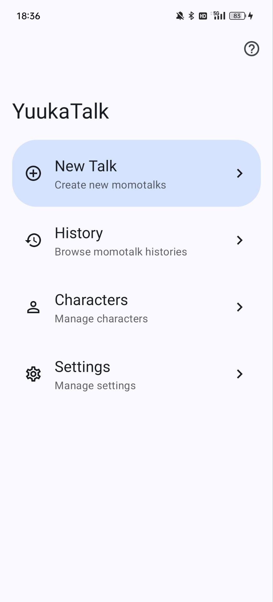
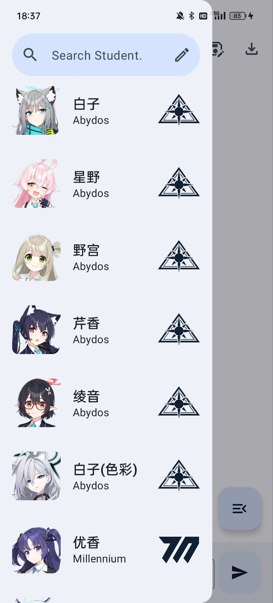
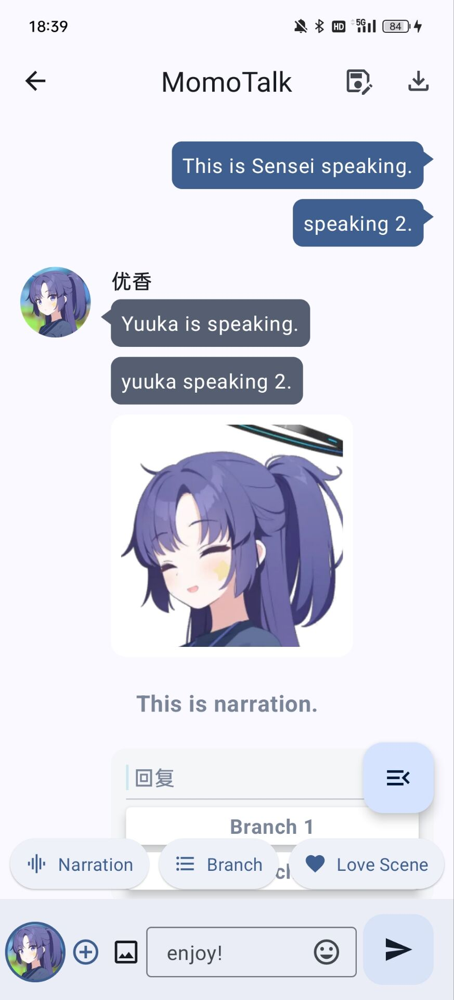

  

# Introduction

YuukaTalk is a brand-new momotalk editor app for Android aiming to provide more comfortable experience for re-creation authors.

We already have amazing works such as **YuzuTalk**, **ClosureTalk**, **MolluTalk**, and **MoeTalk**. However, each of above-mentioned editors either has been taken down or not supports mobile phone well, which is the inspiration this app is given.

Why named YuukaTalk? I love Yuuka.

# Previews

  
  
  

# Features

- Complete offline.
- Easy to operate.
- Support all kinds of message.
- Support edit history message.
- Support saving talk projects.
- Support DIY characters.
- Much more to discover...

# Installation

Still WIP.

# TODOs

- [x] Support stashing momotalks in progress.
- [x] Browse histories.
- [x] Pre-include emojis.
- [x] Search student by keyword.
- [ ] DIY characters.
- [x] revert and reedit talks.
- [ ] Import all students in BlueArchive.(WIP)
- [ ] Numerous settings.
- [x] Student information browse.
- [ ] Multi-language.
- [ ] support insert message.